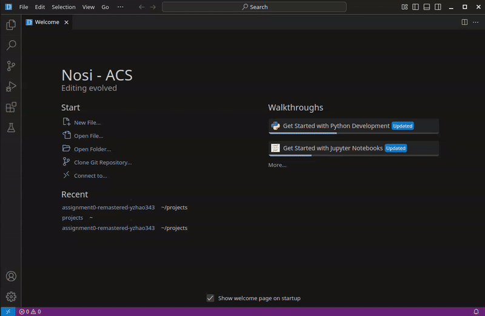
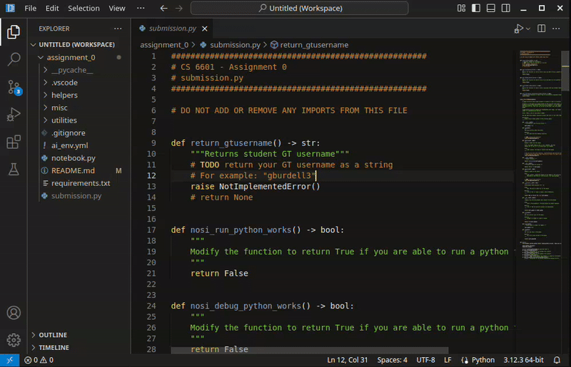
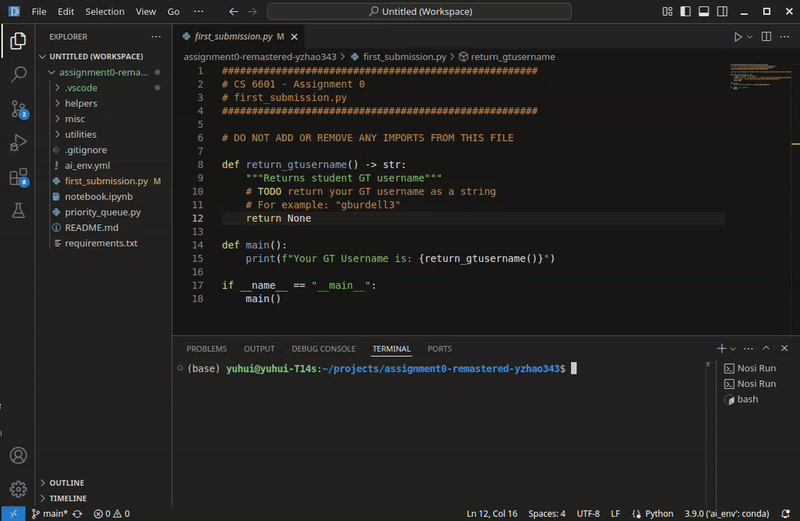
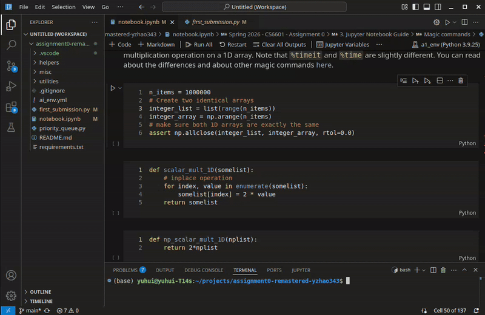
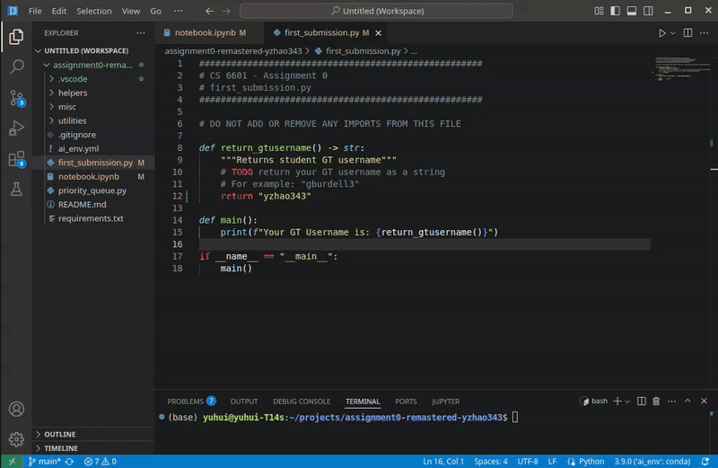
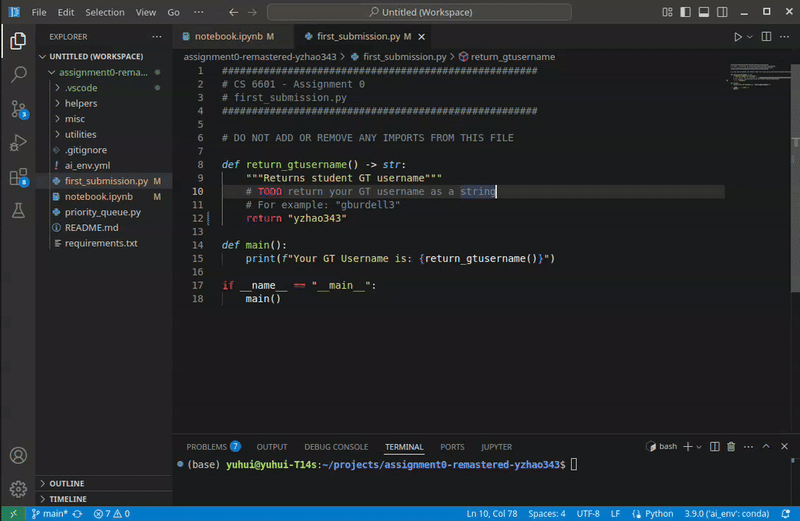
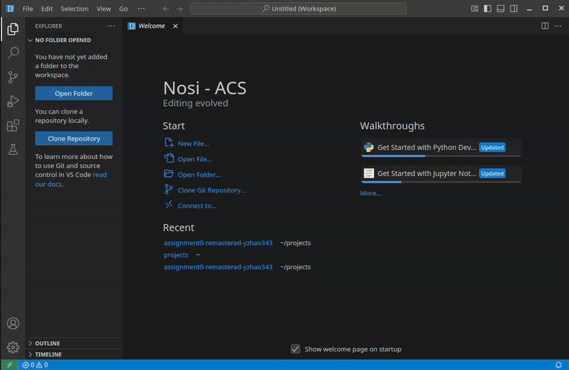
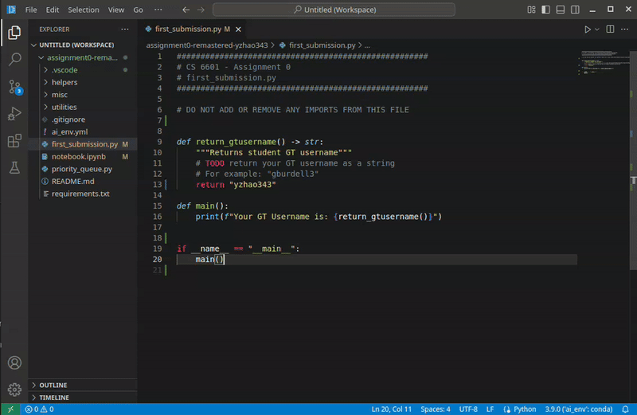
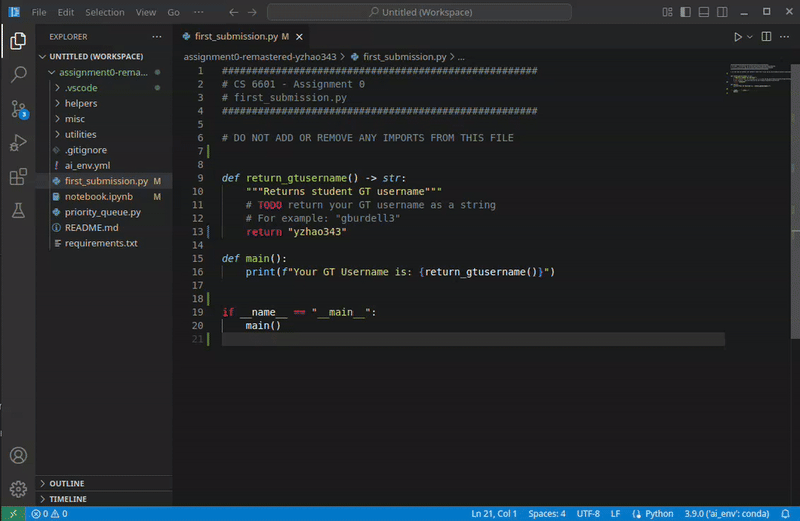
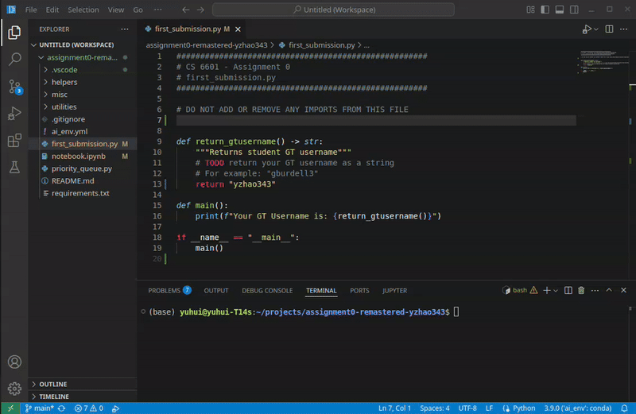

# Nosi
Nosi is a fork of VS Code. It is an anti-cheating and AI powered IDE. Its goal is to improve coding education, especially addressing the challenges posed by Large Language Models (LLMs). Nosi is designed to edit and run the encrypted homework templates files distributed to students. It logs interaction data during the coding/editing process. In the short term, these behavioral data are used to ensure students are producing their own work in accordance with academic integrity policies. Specifically:
 * Encryption: Designed to add “friction” to prevent the direct use of LLMs to solve assignments.
 * Logging: Used to validate potential violations by analyzing the process of creation, not just the final result.
In the long term, Nosi will evolve into an interactive, AI-powered IDE that can detect learning difficulties and provide real-time pedagogical support.

## Nosi features and common operations
Below are key features the latest Nosi v0.0.7 supports. Please use it as a reference for your regular coding workflow.

### Opening and removing assignment folder in workspace

### Verifying and selecting environment from the lower right

### Running encrypted python files

### Running encrypted Python Interactive Window

### Installing extensions and changing theme

### Syntax Error highlighting

### Search/replace by highlighting, then ctrl+f/ctrl+h (option+cmd+h for Mac OS), and redo by ctrl+z
Note: don't highlight, ctrl+c and then ctrl+v into the search box as it will paste as encrypted text. Just highlight the text, and ctrl+f for search and ctrl+h for replace.

### Ruff setup and file formatting
Ruff should be automatically installed for you by Nosi.

If the automatic install did not work, you can install Ruff([link](https://docs.astral.sh/ruff/)) by running `pip install ruff` in your conda base environment first.

To format files, run `ctrl+shift+p` to bring up the command palette and type or select `Format Document` or `Format Document With...` -> `nosi-extension`

Changing the Ruff linter and formatter default setting is currently not supported.

### Hover window and auto fix (via ruff)

### Setting up the debugger for debugging python

For v0.0.7 debugger should be automatically configured. You typically don't need to do this unles for advanced troubleshooting.

### Debug encrypted python files

### git extension support

Both inline and split fig diff view work

### Using the denosifier to decrypt assignment

Each assignment has a different decryption key. The decryption key will be provided after the deadline.

## Current state of Nosi, Pitfalls and Workarounds

### Nosi troubleshooting steps:
1. Always do a sanity check on the environemnt. Activate your environment first `conda activate env_name` run `which python` and `python --version` to verify that in the environment, the python path is what you expect to be. Also run which pip to see if the pip and python are actually from the same environment. If they are, you can install using `pip install -r requirements.txt`. If they are not, but the python path is expected, use `python -m pip install -r requirements.txt`. If even the python path by default is not what you expect and you are sure you activated that environment correctly, then it means you have some weird misconfiguration. For example conda environment does not load in your bash/powershell profile, or you have an environment variable overriding the path set by conda. You need to get that misconfiguration sorted out. Just to get things running fast, you can install the environment by `/full/path/to/python -m pip install -r requirements.txt`.

1. Verify libraries in the `requirements.txt` are all installed by running `python -m pip list`. Use full path to python if needed.

1. When reinstalling Nosi, please make sure you delete the cache folder. (See more info about the cache folder below, under the reinstalling section)

1. In Nosi, make sure you selected the correct environment before running the code. Look at the lower right corner and it should say the python version and the name of  your environment. For Jupyter or interactive window, it should be at the upper right.  If Nosi does not detect your newly installed environment, restart and try again.

1. Sometimes, rebooting computing entirely also helps.

1. If you get the "null bytes" error, first make sure you actually opened entire homework assignment in your workspace (opened the folder). Then opened the file. Nosi does not know to decrypt your file if they are not in opened folder or workspace.

1. If you get strange issues, try close all of your opened files, close the folder (remove from workspace). Restart Nosi (on Mac, make sure to quit it in dock as well when closing). add your folders to workspace (open folder), and open the files to see if it works.

1. If there are still weird issues. Close all of your opened files, close the folder (remove from workspace). Completely close nosi. Delete the cache folder entirely, reboot computer just to be safe, restart Nosi and try again. 

1. I believe if all the above are tried and verified, most bugs should be fixed. If all the above does not fix the bug, reinstalling likely won't either (unless there are other failure mode I am not aware of).

1. You can always run Nosi in the school provided VM ([https://mycloud.gatech.edu/](https://mycloud.gatech.edu/)). I think some students have been using it all semester and it worked fine for them.

1. You can run Nosi in windows WSL as well. If you prefer something protable, you can use the AppImage build of Nosi. No need to install.

### Tips for reinstalling Nosi
Please uninstall your old Nosi using the default uninstall method of your operating system:
 * Windows: `Start` -> `add or remove programs`, find Nosi (GT Nosi - ACS) and then uninstall
 * Mac OS: In `Applications`, drag `Nosi - ACS.app` to trash bin
 * Linux: `sudo apt-get purge nosi-acs`
Then, download the appropriate files from the release page.

Locate the Nosi user cache and settings folder (shown below) and permanately delete them. Please make sure you do this step! DO NOT SKIP!
 * MacOS: `~/Library/Application Support/Nosi - ACS`
 * Windows: `%APPDATA%\Nosi - ACS`
 * Linux: `~/.nosi-acs`

Reboot your computer (optional, just to be safe)

Reinstall your freshly downloaded Nosi.

To check your Nosi install, you can go to `Help` -> `About` (Or on Mac OS the Nosi - ACS menu on the top bar to the right of the Apple icon) and check the build time. For Nosi v0.0.7, the build `Date` should be May 17.

### Nosi is slow (or stuck) to load a file or the homework folder
Sometimes, there might be an infinite load bar on a file, or a message saying the file is binary and cannot be displayed. There are several things to try:
 * Make sure you are only adding the homework folder to your workspace. Not an upper level folder containing your homework assignment folder. Also not the homework file itself.
 * Close the file and re-open from the workspace panel on the left of the screen.
 * Completely close or remove your homework folder from the workspace. You can do that by right-clicking folder and use the menu. Or, alternatively, go to `File` and close the workspace entirely. Then reopen the homework folder.

### conda environment not found.
Try reboot nosi and see if the environment show up. If still not. Locate the Nosi user cache and settings folder and permanately delete them.
 * MacOS: `~/Library/Application Support/Nosi - ACS`
 * Windows: `%APPDATA%\Nosi - ACS`
 * Linux: `~/.nosi-acs`

### `Go to definition` to other files may fail if not opened
Open the file in a tab first and it should then work.

### View a rendered version of a markdown (.md) file
On the left explorer panel, right click on the markdown (.md) file, and then click `Open Preview`.

### Pasting into search window is encrypted
To search locally in a file: Highlight the text, and ctrl+f for search and ctrl+h (option+cmd+h for Mac) for replace.

For using the left panel to search across files, you need to type the search target in.

For searching function names in general, you can also use the [outline view](https://code.visualstudio.com/docs/getstarted/userinterface#_outline-view).

### Debugger hangs after hitting the Run Nosi Debug button
It is possible that you don't have the `debugpy` library in your environment.

Please activate your assignment environment first: `conda activate ai_env`

Run this command to verify that debugpy library is installed in your environment: `pip list | grep debugpy`

If you don't see it, run: `pip install debugpy`

### Rename variable by right-clicking on variable and then rename does not work
A potential workaround is to highlight the variable, and then press ctrl+d several times to select all the variables within the file, and then type the new variable name.

## Supported OS and Platform
 * Windows: x64, arm64
 * Linux - .deb: x64, arm64
 * Linux - .rpm: x64, arm64
 * Linux - .AppImage: x64, arm64
 * Linux - .snap: x64, arm64
 * MacOS: Intel x64, Apple Silicon arm64
 * You can use linux build of Nosi in Windows subsystem for Linux v2 (WSL2)
 * You can install the amd64/x64 windows build of Nosi in Gatech VLab virtual machine ([link](https://mycloud.gatech.edu/))
